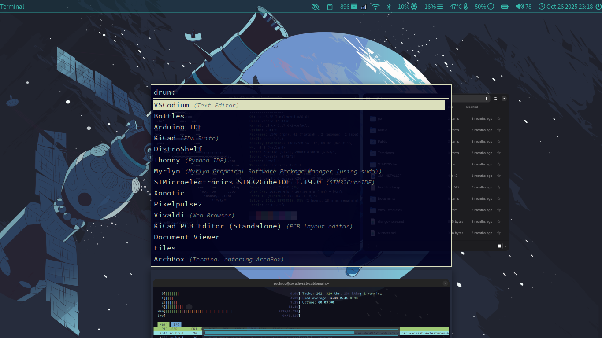

# dotfiles
Finally, my personal dotfiles repository! Targeting Niri, Waybar, Alacritty and systemd by default. 

Yes, I use micro over nano, \*vi\*, emacs, etc.  

> [!TIP]
> Put wallpaper in `~/Pictures/Background.png` (To change this, edit `~/.config/systemd/user/swaybg.service`). This repo also tries to download to the location, so syncing may reset your background back to the default image.

> [!TIP]
> If you edit  ~/.config/systemd/user/swaybg.service, remember to reload the rules with: `systemctl --user daemon-reload`

## Preview





## Required Packages

Ensure the following commands are available on your system:

```
rust
cargo
git
gtk4-devel
gtk4-layer-shell-devel
libopenssl-devel
pkg-config
wpctl
brightnessctl
pamixer
systemctl
waybar
swaybg
xwayland-satellite
firefox
wl-paste
alacritty
cliphist
nm-applet
alacritty
rofi
wob
niri
flatpak # for browser scripts
```

### Python deps:
(needed for sync.py)
```
GitPython: python3-GitPython
```

### Required for markdown script
```
glow
npm (preferably run `nvm use node` before starting) (nodejs-common on tumbleweed)
```
### Required for extract script
```
unzip
zstd
xz
tar
gzip
gunzip
```

## Installation

```bash
git clone https://github.com/sounddrill31/dotfiles; cd dotfiles
```

```bash
python3 sync.py
```

To Back up, 
```bash
python3 backup.py
```

## Choices
- OpenSUSE Tumbleweed
- Niri
- Waybar
- Gnome Files
- Alacritty
- Sherlock for primary launcher (Mod+D) and clipboard(Mod+V)
- Rofi for secondary launcher(Mod+Shift+D, backup) and clipboard(Mod+Alt+V)
- Vivaldi, installed from flatpak
- Firefox
- Swaylock, swaybg
- Micro for text editing
- Evolution for Email
- rofi
- Telegram Desktop
- Discord, Vivaldi New Tab. [Old Script with firefox](https://gist.github.com/sounddrill31/7e01a6ef562e3497e38ba583a62f7ce1)
- Whatsapp, Vivaldi New Tab. [Old Script with firefox](https://gist.github.com/sounddrill31/a7428018778f788a95344ab9e6cb1353)

etc

## Credits (in no particular order)
Directly used resources from:
- [OpenSUSE/OpenSUSEway](https://github.com/openSUSE/openSUSEway/blob/main/.config/waybar/config.jsonc) for Waybar config
-  for Wallpaper(s)